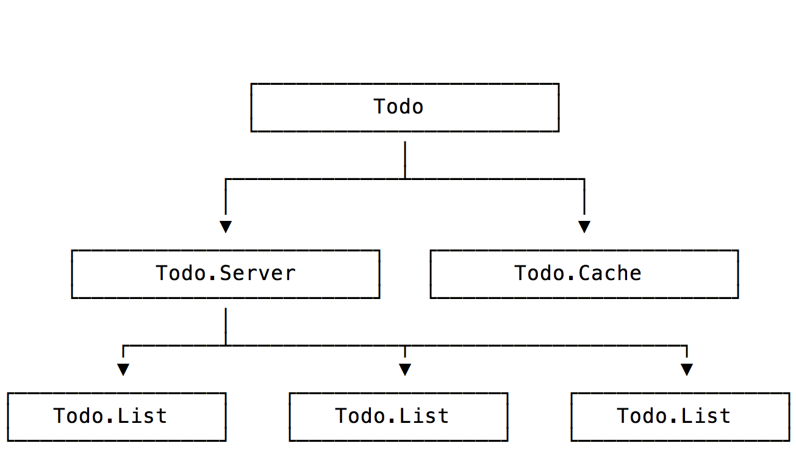

# Todo

A simple todo list application, intended to demonstrate how to design a fault-tolerant OTP application using supervisors and ETS tables.

Watch it being built in Episode 16 of [LearnElixir.tv](https://www.learnelixir.tv).

## Structure

